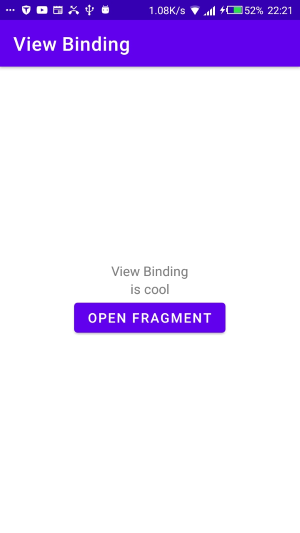
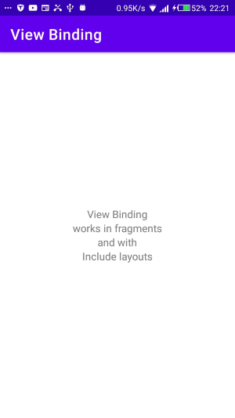
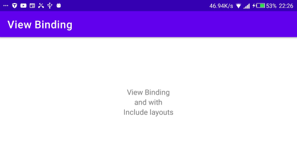

# ViewBinding - Activities and Fragments

## Setup instructions

```xml
android {
    ...
    buildFeatures {
        viewBinding true
    }
}
```

If you want a layout file to be ignored while generating binding classes, add the `tools:viewBindingIgnore="true"` attribute to the root view of that layout file:

```xml
<LinearLayout
        ...
        tools:viewBindingIgnore="true" >
    ...
</LinearLayout>
```

### **Using view binding In Activities**

1. Call the static inflate() method included in the generated binding class.This creates an instance of the binding class for the activity to use.

1. Get a reference to the root view ie. binding.root for kotlin or binding.getRoot for java

1. Pass the root view to setContentView() to make it the active view on the screen.

```kotlin
private lateinit var binding: ActivityMainBinding

override fun onCreate(savedInstanceState: Bundle?) {
    super.onCreate(savedInstanceState)
    binding = ActivityMainBinding.inflate(layoutInflater)
    setContentView(binding.root)
}
```

You can now use the instance of the binding class to reference any of the views:

```kotlin
binding.name.text = viewModel.name
binding.button.setOnClickListener { viewModel.userClicked() }
```

### **Using view binding in fragments**

1. Call the static inflate() method included in the generated binding class. This creates an instance of the binding class for the fragment to use.

1. Get a reference to the root view by either calling the getRoot() method or using Kotlin property syntax.

1. Return the root view from the onCreateView() method to make it the active view on the screen.

> Note: The inflate() method requires you to pass in a layout inflater. If the layout has already been inflated, you can instead call the binding class's static bind() method. To learn more, see [an example from the view binding GitHub sample.](https://github.com/android/architecture-components-samples/blob/master/ViewBindingSample/app/src/main/java/com/android/example/viewbindingsample/BindFragment.kt#L36-L41)

```kotlin
private var _binding: ResultProfileBinding? = null
// This property is only valid between onCreateView and onDestroyView.
private val binding get() = _binding!!

override fun onCreateView(
    inflater: LayoutInflater,
    container: ViewGroup?,
    savedInstanceState: Bundle?
): View? {
    _binding = ResultProfileBinding.inflate(inflater, container, false)
    val view = binding.root
    return view
}

override fun onDestroyView() {
    super.onDestroyView()
    _binding = null
}
```

You can now use the instance of the binding class to reference any of the views:

```kotlin
binding.name.text = viewModel.name
binding.button.setOnClickListener { viewModel.userClicked() }
```

Links to this examples implementation:  
[In Activity](./app/src/main/java/com/timac/viewbinding/MainActivity.kt)  
[In Fragment](./app/src/main/java/com/timac/viewbinding/ExampleFragment.kt)

This example also shows that viewbinding also works with:

- include layouts

- other layout variations such as landscape variations  
  (In the case of there being 2 variations of a layout, you will have to check for nullability when using view binding):

```kotlin
binding.fragmentTextView2?.text = "works in fragments"
```

### **_Differences from findViewById_**

- **Null safety**: Since view binding creates direct references to views, there's no risk of a null pointer exception due to an invalid view ID. Additionally, when a view is only present in some configurations of a layout, the field containing its reference in the binding class is marked with @Nullable.

- **Type safety**: The fields in each binding class have types matching the views they reference in the XML file. This means that there's no risk of a class cast exception.

### **_Comparison with data binding_**

- **Faster compilation**: View binding requires no annotation processing, so compile times are faster.

- **Ease of use**: View binding does not require specially-tagged XML layout files, so it is faster to adopt in your apps. Once you enable view binding in a module, it applies to all of that module's layouts automatically.

### **_Limitations of viewbinding in relation to data binding_**

- View binding doesn't support [layout variables or layout expressions](https://developer.android.com/topic/libraries/data-binding/expressions), so it can't be used to declare dynamic UI content straight from XML layout files.

- View binding doesn't support [two-way data binding](https://developer.android.com/topic/libraries/data-binding/expressions).

### Screenshots




